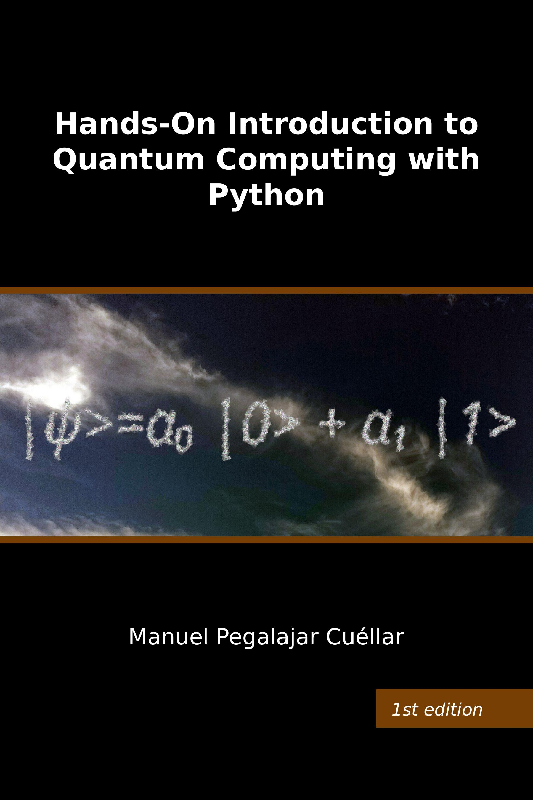

# Hands-On Introduction to Quantum Computing with Python

This repository contains the source code associated with the book **Hands-On Introduction to Quantum Computing with Python**. To obtain it, download the file *IntroQC.zip* and extract it to your desired folder. The source code can be run if you have a Python interpreter installed, along with the libraries required in the book, as indicated in the section *Hands-on: software installation and accessing the source code*.

  

